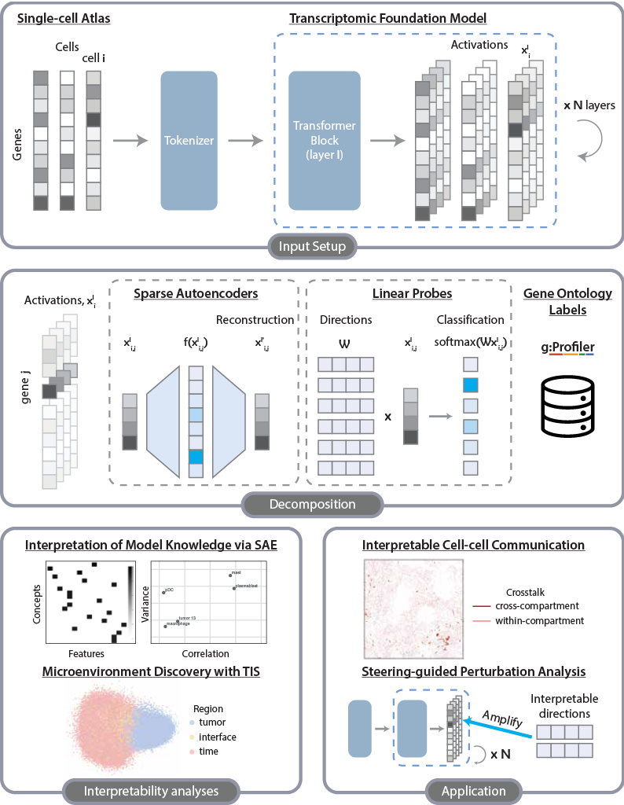

# interpTFM: Mechanistic Interpretability for Transcriptomic Foundation Models

## Introduction

This repository implements **interpTFM**, a mechanistic interpretability framework for analyzing internal representations of Transcriptomic Foundation Models (scGPT) using a CosMx lung cancer spatial transcriptomics dataset.  
The framework evaluates both gene-token and cell-token representations through:

- **Sparse Autoencoders (SAEs)** for disentangling latent features  
- **F1-based concept alignment** with Gene Ontology  
- **Transcriptomic Interpretability Scoring (TIS)**  
- **Interpretable, spatially grounded cell–cell crosstalk** inference without ligand–receptor priors  
- **Steering-based perturbation analysis** using linear probe directions  

<!-- These components reveal biological programs encoded by TFMs and support steerable perturbation-like analyses. -->



---

## 🔁 Workflow Overview

### Environment Setup

```bash
conda create -n interptfm python=3.10
conda activate interptfm

pip install -r requirements4fm.txt
```

Install extra packages as needed.

---

### 1. Extract scGPT Activations

Extract activations from pretrained scGPT across all transformer layers using the CosMx 960‑gene spatial dataset.

Notebook:

```
./scgpt/get_acts_scgpt.ipynb
```

---

### 2. Train Sparse Autoencoders (SAEs)

Train SAEs to obtain sparse, partially disentangled features.

```
./train/train_sae_scgpt_acts.ipynb
```

Normalize the resulting dictionary:

```
./sae/normalize.ipynb
```

---

### 3. Gene–Concept Alignment

Compute F1 scores between SAE features and curated gene sets.

Steps:

1. Query concepts with gProfiler  
2. Convert annotations to binary matrices  
3. Compare activations to concepts  
4. Compute per-feature and aggregated F1 scores  

Notebooks:

```
./gprofiler_annotation/gprofiler_out_to_binary.ipynb
./concept/compare_acts_to_gprofiler_concepts.ipynb
./concept/generate_meta_eval.ipynb
./concept/calculate_f1.ipynb
./concept/report_final_metrics.ipynb
```

---

### 4. Transcriptomic Interpretability Scoring (TIS)

Compute 2AFC-based interpretability scores with an expression‑space judge model.

Notebook:

```
./concept/MIS.ipynb
```

---

<!-- ### 5. Sparse Logistic Regression (SLR)

Fit SLR models to identify minimal gene sets predicting each SAE feature.

Notebook:

```
./slr/slr_feature_drivers.ipynb
```

--- -->

### 5. Spatial Crosstalk Analysis

Infer ontology-aware communication using interpretable features and spatial proximity.

Notebook:

```
./ccc/ccc_analysis.ipynb
```

---

### 6. Steering Experiments

Train Linear Probes and perform steering Experiments

Steps:

1. Construct activations with concept ground truth  
2. Train Linear Probes
3. Analyze activation projections on Linear Probe directions
4. Use concept‑specific directions to perturb scGPT activations
5. Analyze steering results

Python files (with notebook structure):

```
./linear_probe/construct_dataset_purt.py
./linear_probe/train_probe.py
./evaluation/steering/lp_analysis.py
./evaluation/steering/intervene_construct.py
./evaluation/steering/intervene_analysis.py
```

---

## 📚 Citation

```bibtex
@misc{interptfm2025,
  author       = {Hu, Wen, Lin, Qin, Yuan, Liu, Klindt, Zhang, Carja, Zhou},
  title        = {interpTFM: Mechanistic Interpretability for Transcriptomic Foundation Models},
  year         = {2025},
  url          = {https://github.com/OliiverHu/interGFM}
}
```

---

## 📫 Contact

yunfei.hu [at] vanderbilt.edu  
zihangw [at] cs.cmu.edu
